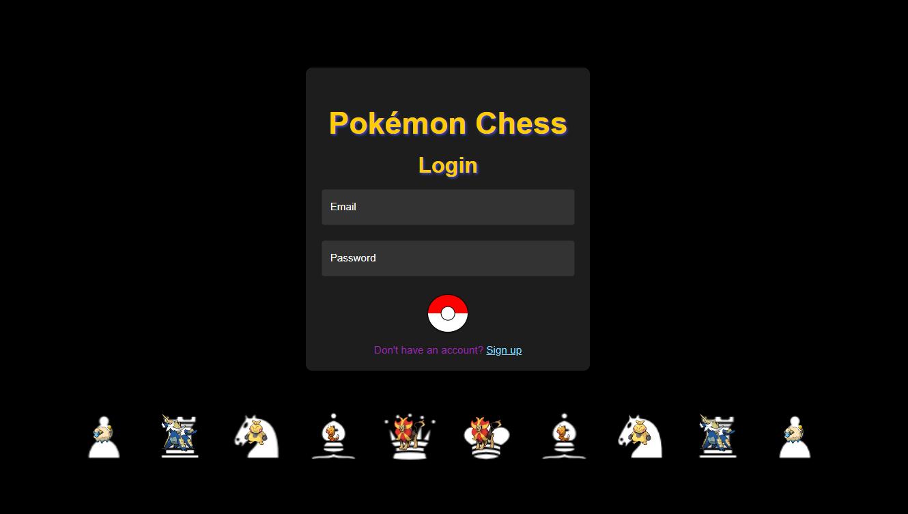
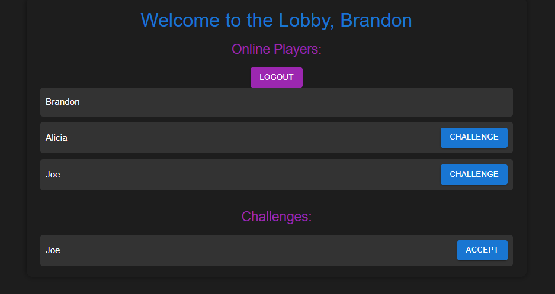
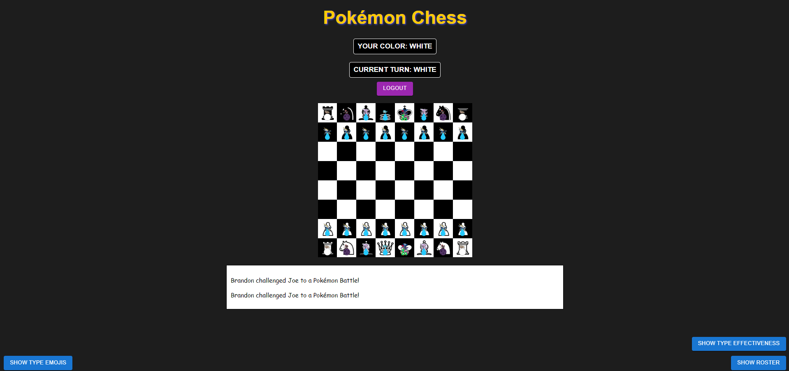
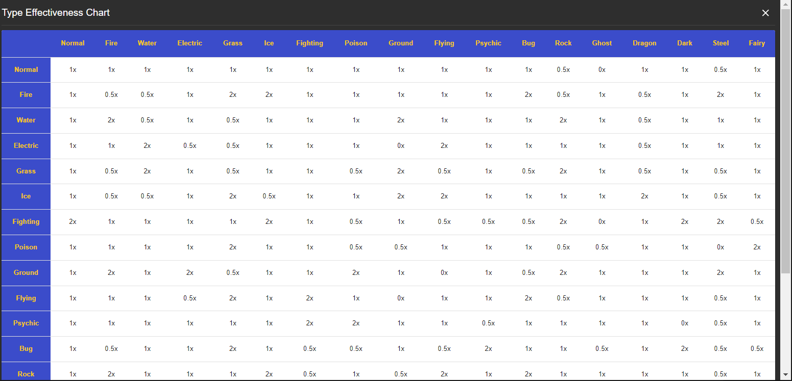

# Pokémon Chess

[Deployed Application](https://pokemon-chess-1.onrender.com/)

Pokémon Chess is a unique chess game where each chess piece represents a Pokémon. The game introduces an extra layer of strategy by incorporating Pokémon type effectiveness, allowing players to utilize super-effective moves for additional advantages.

## Table of Contents
- [Features](#features)
- [Getting Started](#getting-started)
- [Gameplay](#gameplay)
- [Technical Details](#technical-details)
- [Screenshots](#screenshots)
- [Contributing](#contributing)
- [License](#license)

## Features

- **Pokémon Integration**: Each chess piece is represented by a Pokémon.
- **Type Effectiveness**: Moves can be super-effective, not very effective, or neutral based on Pokémon types.
- **Turn-Based Gameplay**: Standard chess rules apply, with added turn advantages for super-effective moves.
- **Real-Time Multiplayer**: Challenge and play against other users in real-time.

## Getting Started

### Prerequisites

- Node.js
- MongoDB
- npm or yarn
- React.js

### Installation

1. Clone the repository:
   ```bash
   git clone https://github.com/yourusername/pokemon-chess.git
   cd pokemon-chess

2. Install server dependencies:
    ```bash
    cd backend
    npm install

3. Install client dependencies:
    ```bash
    cd frontend
    npm install

### Configuration
1. Create a `.env` file in the backend directory and add your environment variables:
    ```bash
    PORT=5000
    MONGO_URI=your_mongo_db_uri
    REACT_APP_BACKEND_URL=http://localhost:5000
    CORS_ORIGIN=http://localhost:3000

2. Create a `.env` file in the frontend directory and add your environment variables:
    ```bash
    REACT_APP_BACKEND_URL=http://localhost:5000

### Running the Application
1. Start the server 
    ```bash
    cd backend
    npm start

2. Start the client
    ```bash
    cd frontend 
    npm start

3. Open your browser and navigate to `http://localhost:8000`.

## Gameplay

### Rules

- **Basic Chess Rules**: Standard chess rules apply.
- **Type Effectiveness**: When a Pokémon attacks another, type effectiveness is considered:
  - **Super-Effective**: The attacking Pokémon captures the defending piece and the player gets an extra turn.
  - **Not Very Effective**: Both the attacking and defending pieces are removed from the board.
  - **Neutral**: The attacking Pokémon captures the defending piece.

### Controls

- **Move Pieces**: Click on a piece and then click on the destination square to move it.
- **Challenge Players**: In the lobby, click on a player's name to challenge them.

## Technical Details

### Backend

- **Node.js** and **Express** for the server
- **Socket.io** for real-time communication
- **MongoDB** for database

### Frontend

- **React** for the user interface
- **React Router** for navigation
- **Material-UI** for component styling

### Custom Chess Logic

The custom chess logic integrates Pokémon type effectiveness into standard chess moves, with additional rules for handling piece interactions based on Pokémon types.

## Screenshots

### Login Screen


### Lobby


### Game Board


### Type Effectiveness Chart



